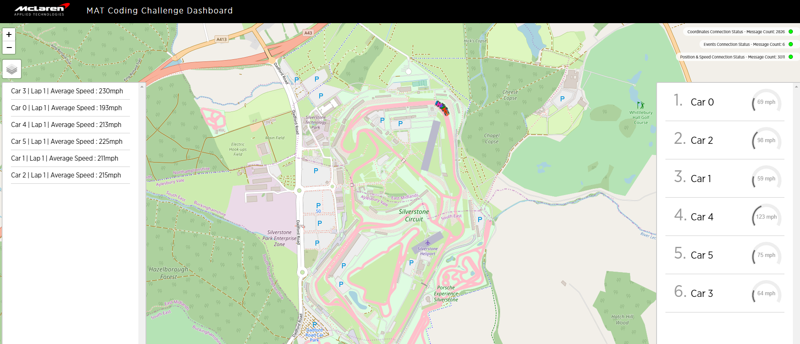

# Lorcan O'Donoghue MAT Challenge Submission

## Prerequisites:

* [docker](https://docs.docker.com/)
* [docker-compose](https://docs.docker.com/compose/)

## Introduction

The purpose of this project is to demonstate the below
* write and structure a simple backend application in an appropriate language of your choice
* parse and transform streamed telemetry data
* deliver a component to integrate into a stack of technologies

## Getting Started

I developed my application using C# .Net Core 3.1, Docker

To start all components:

```console
$ docker-compose pull
$ docker-compose up -d
Creating network "mat-coding-challenge_default" with the default driver
Creating broker ... done
Creating source_gps                 ... done
Creating carcoordinatesprocessorapp ... done
Creating mqtt-to-websocket          ... done
Creating webapp                     ... done
```

Open (http://localhost:8084)

Test the setup with `mosquitto_pub` or a similar MQTT client:

```console
$ mosquitto_pub -t events -f examples/event.json
$ mosquitto_pub -t carStatus -f examples/position.json
$ mosquitto_pub -t carStatus -f examples/speed.json
```

You should now see a car's position and an event in the webapp.

## Explanation

I created an Application to Subscribe to the MQTT Broker which provides a topic for 'carCoordinates'.
The below is the structure and example of this topic message.

* **carCoordinates**

    ```console
      {
        timestamp: number,
        carIndex: number,
        location: {
          lat: float,
          long: float
         }
      }
    ```

  e.g.

    ```json
      {
        "timestamp": 1541693114862,
        "carIndex": 2,
        "location": {
          "lat": 51.349937311969725,
          "long": -0.544958142167281
         }
      }
    ```
I would parse and transform this streamed telemetry data, enriching and aggregating this data.
I would then publish this to two different topics 'carStatus' and 'events'

- **carStatus**

    ```console
      {
        timestamp: number,
        carIndex: number,
        type: string<SPEED|POSITION>,
        value: number
      }
    ```

  e.g.

    ```json
      {
        "timestamp": 1541693114862,
        "carIndex": 2,
        "type": "POSITION",
        "value": 1
      }
    ```

- **events**

    ```console
      {
        timestamp: number,
        text: string
      }
    ```

  e.g.

    ```json
      {
        "timestamp": 1541693114862,
        "text": "Car 3 | Lap 1 | Average Speed : 230mph"
      }
    ```
Example of the Webpage after carStatus and events message have been published


To Calculate the Speed I would need to get the Distance and time between two points.
To do this I would need two entries for a single car, as in timestamp n and n-1. 
To generate the Distance I used the GeoCoordinate Class which is a .Net Core prebuilt implemenation of the Haversine Formula, this formula calculates the distance between two points 'as-the-crow-flies'.
To generate the Time, I got the absolute difference between the timestamps of n and n-1

From the above it was a matter of dividing the distance by the time to generate the speed in mps, I required to provide the speed in mph.
To convert to Miles from Meters I divide by 1609.344. and to convert the seconds to hours I divided by 3600.

## Tests

I have a Code Coverage of 72%
But this is including not testable class like the Mqtt Client used which is not required to test as this should be handled by the implementer

Excluding 


